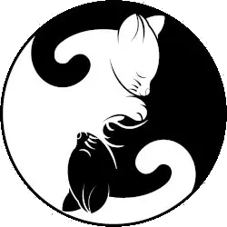

<!-- markdownlint-disable MD025 -->
# {{ page.title }}



## Disclaimer



## Volume 01: Children of Light and Darkness

<!-- markdownlint-disable MD033 -->







Twin orphans grow up in a remote village.
They don't know much about their origins, but their foster grandfather never tells them anything.
All they have of their real parents are the pendants they have always worm.
Their peaceful world crumbles when they're forced to leave the country — and thus are forced to leave their village.

This story is set in the the same universe as <a href="{{'/crystaldown/' | absolute_url }}">Crystal Down</a>.

<h3 class="mt-3">Children of Light and Darness Chapters</h3>





<!-- markdownlint-enable MD033 -->

[Prologue](./01-children-of-light-and-darkness/00-prologue/){:id="next" style="display: none"}

### Glossary

See the [Crystal Down Glossary](/crystaldown/glossary/){:.btn .btn-large .btn-primary}.
